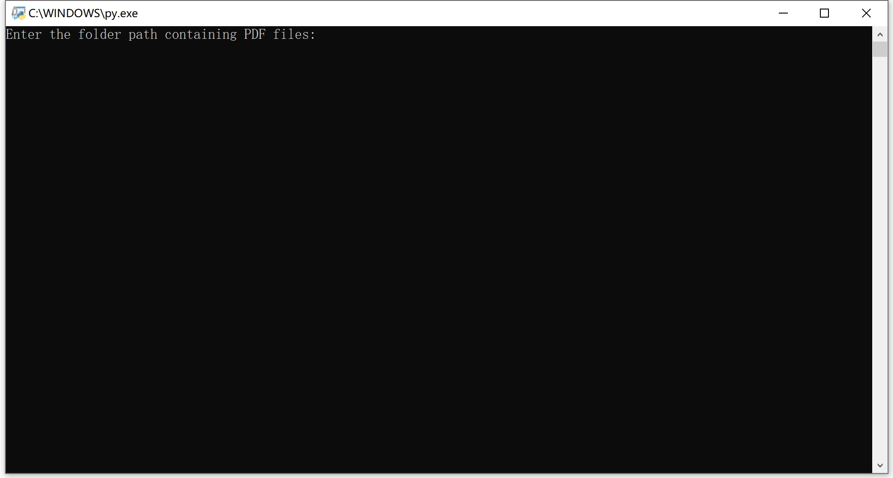
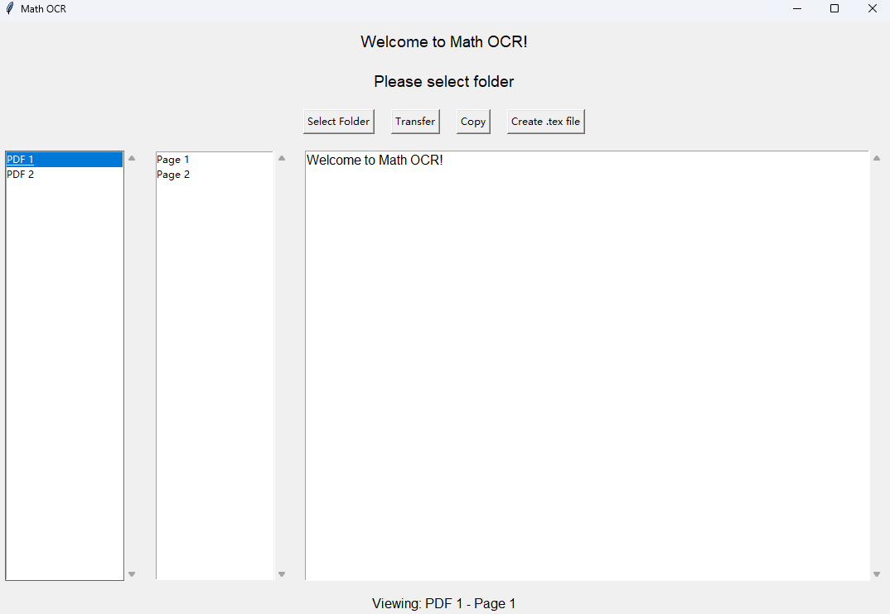

# User Guide
## Step 1: Ollama Framework Setup
 
- Go to the official webpage [here](https://ollama.com/)
- Click "Download" button to download the `OllamaSetup.exe` installer.
- Run the installer and follow the on-screen instruction to complete the installation. If you already have the Ollama installed, please update the version to 0.7.0 or newer.
- After installation, open the Command Prompt and type the following command to verify its version:  
    ```
    ollama --version
    ```
- If the version number is displayed on screen, the installation is successful

## Step 2: Download the Model
Type the command below into the Ollama terminal and run:  
``` 
ollama run qwen2.5vl:3b
```  
Ollama will automatically download the required vision model

## Step 3: Use the Model in Python
- First, install required package by typing the following command in the Python terminal:
    ```
   pip install ollama
   pip install Pillow
   pip install PyMuPDF
   ```
- _download from github (TBD)_
- Launch the `pdf_to_tex_cli.py` to transfer with command line:
   - Enter the folder path. Please ensure that the folder contains only PDF files.
   - Wait for transferring, and `*.tex` file will be created under the folder.

- Or you can launch the `main.py` file to interact with the GUI:  

   - Click the `Select Folder` to select the source folder. Please ensure that the folder contains only PDF files.
   - Click the `Transfer` to convert the selected PDF into LaTeX code. Depending on your hardware and size of the PDF, it should take about 10 ~ 30 second to process each page. When it shows "Transfer complete", you can check the result.
   - Use the `Copy` button to copy the result, or do it manually by selecting required results on the bottom right section.
   - Save the result in `*.tex` format by click the `Create .tex file` button.

## Hardware reqirement
- Windows: The program requires around 6GB of available GPU VRAM.
- Mac: The program can run on all Macs with Apple Silicon (M series).

## Note:
- The GUI was only tested on Windows, it could be under performance while be used on other operating systems.
- Right now you can only import the original Qwen model, which is not fine-tuned for math OCR tasks. 
  Due to limited time, we can not convert our fine-tuned Qwen 2.5b model from Hugging Face into GGUF format.